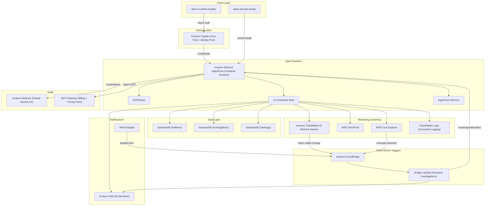
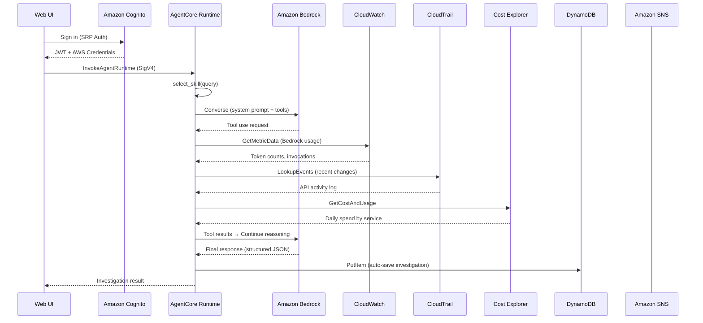
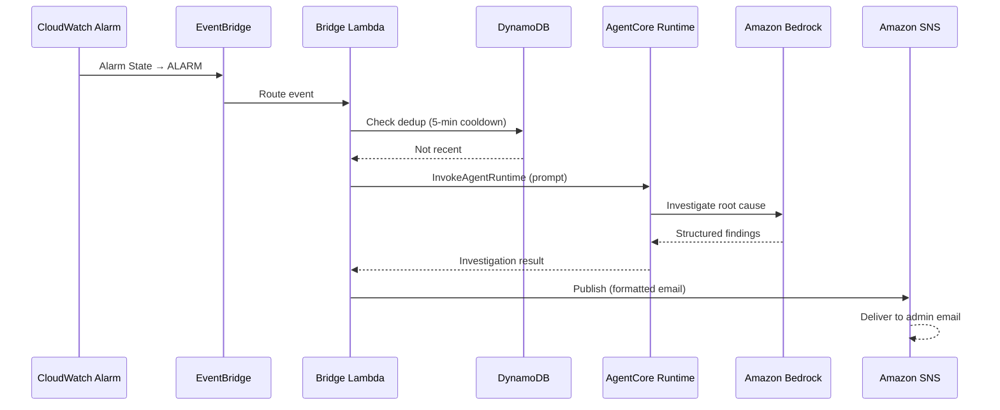

# CostOp Intelligence Agent — Architecture Document

## Architecture Overview

CostOp Intelligence Agent is a real-time FinOps monitoring and investigation agent built on **Amazon Bedrock AgentCore**. It autonomously detects cost anomalies, investigates root causes using hypothesis-driven reasoning, and delivers structured reports via email and Slack.

The system extends the AWS FinOps Agent pattern with proactive alerting, pattern memory, per-agent cost tracking, and a web-based investigation console.

> **Well-Architected Decision:** The agent uses Amazon Bedrock AgentCore (managed container runtime) instead of self-managed ECS/EKS to minimize operational overhead while maintaining full tool-use capabilities via the Strands SDK.

### Project Structure

```
cloud-intelligence-agent/
├── agentcore/                    # Agent runtime (containerized)
│   ├── agent_runtime.py          # Main entrypoint — BedrockAgentCoreApp
│   ├── tools.py                  # 12 combined tools (from 36 original)
│   ├── skill_loader.py           # Query-based skill routing
│   ├── slack_handler.py          # Slack Socket Mode integration
│   ├── streamable_http_sigv4.py  # MCP Gateway SigV4 auth
│   ├── skills/                   # Skill definitions (SKILL.md)
│   │   ├── cost-overview/
│   │   ├── cost-spike-investigation/
│   │   └── agent-economics-review/
│   ├── Dockerfile                # Multi-stage Python 3.12 build
│   └── requirements.txt
├── cloudformation/
│   └── costop-template.yaml      # Full IaC (single-stack deployment)
├── web/                          # Frontend (Amplify-hosted SPA)
│   ├── index.html
│   ├── main.js                   # Auth + Agent invocation + UI
│   ├── package.json
│   └── vite.config.js
└── scripts/
    ├── deploy.sh                 # CDK-based deployment
    └── deploy-ui.sh              # UI deployment helper
```

---

## System Architecture Diagram



---

## AWS Services Used

| Service | Purpose | Configuration | Documentation |
|---------|---------|---------------|---------------|
| **Amazon Bedrock AgentCore** | Managed container runtime for the AI agent | Container from ECR Private; PUBLIC network; IAM role with 14 statements | [Docs](https://docs.aws.amazon.com/bedrock/latest/userguide/agentcore.html) |
| **Amazon Bedrock** | Foundation model inference (Claude Sonnet 4.6 / 4.5 / Haiku 4.5) | Configurable model ID; max 12K tokens; Converse API | [Docs](https://docs.aws.amazon.com/bedrock/latest/userguide/what-is-bedrock.html) |
| **Amazon Bedrock AgentCore Memory** | Persistent conversation memory across sessions | Configurable retention (7–365 days); per-session isolation | [Docs](https://docs.aws.amazon.com/bedrock/latest/userguide/agentcore-memory.html) |
| **Amazon Cognito** | User auth (User Pool) + credential vending (Identity Pool) | Admin-only creation; SRP auth; strong password policy | [Docs](https://docs.aws.amazon.com/cognito/latest/developerguide/what-is-amazon-cognito.html) |
| **Amazon CloudWatch** | Real-time Bedrock metrics (5 alarms) | Token Spike, RPM, TPM Quota, Throttles, Errors | [Docs](https://docs.aws.amazon.com/AmazonCloudWatch/latest/monitoring/WhatIsCloudWatch.html) |
| **Amazon CloudWatch Logs** | Bedrock invocation logging for per-caller analysis | Log group: /aws/bedrock/modelinvocations; Insights queries | [Docs](https://docs.aws.amazon.com/AmazonCloudWatch/latest/logs/WhatIsCloudWatchLogs.html) |
| **AWS CloudTrail** | API activity audit trail for investigations | LookupEvents API; 6-hour default lookback | [Docs](https://docs.aws.amazon.com/awscloudtrail/latest/userguide/cloudtrail-user-guide.html) |
| **AWS Cost Explorer** | Cost/usage data, anomaly detection, forecasting | BlendedCost; SERVICE grouping; 7-day lookback | [Docs](https://docs.aws.amazon.com/cost-management/latest/userguide/ce-what-is.html) |
| **Amazon DynamoDB** | 3 tables: Patterns, Investigations, Topology | PAY_PER_REQUEST; simple key schema | [Docs](https://docs.aws.amazon.com/amazondynamodb/latest/developerguide/Introduction.html) |
| **Amazon EventBridge** | Event routing for proactive investigations | 3 rules → Bridge Lambda | [Docs](https://docs.aws.amazon.com/eventbridge/latest/userguide/eb-what-is.html) |
| **AWS Lambda** | Bridge (event→agent) + Build Trigger (ECR copy) | Python 3.12; 120s/600s timeout; 256MB | [Docs](https://docs.aws.amazon.com/lambda/latest/dg/welcome.html) |
| **Amazon SNS** | Alert delivery (email notifications) | Email protocol; auto-created or user-provided topic | [Docs](https://docs.aws.amazon.com/sns/latest/dg/welcome.html) |
| **AWS Budgets** | Monthly cost guardrail for Bedrock spend | COST type; MONTHLY; 80% threshold alert | [Docs](https://docs.aws.amazon.com/cost-management/latest/userguide/budgets-managing-costs.html) |
| **AWS Cost Anomaly Detection** | ML-based anomaly detection | Triggers EventBridge for automated investigation | [Docs](https://docs.aws.amazon.com/cost-management/latest/userguide/manage-ad.html) |
| **Amazon ECR** | Private container registry | MUTABLE tags; lifecycle: keep 3 images | [Docs](https://docs.aws.amazon.com/AmazonECR/latest/userguide/what-is-ecr.html) |
| **AWS CodeBuild** | Image copy from public → private ECR | ARM; BUILD_GENERAL1_SMALL; 10-min timeout | [Docs](https://docs.aws.amazon.com/codebuild/latest/userguide/welcome.html) |
| **AWS Amplify Hosting** | Static web hosting for investigation console | SPA; main branch; config injected at deploy | [Docs](https://docs.aws.amazon.com/amplify/latest/userguide/welcome.html) |
| **AWS IAM** | 6 least-privilege roles | Scoped policies per resource | [Docs](https://docs.aws.amazon.com/IAM/latest/UserGuide/introduction.html) |
| **AWS Service Quotas** | Runtime Bedrock quota checks | ListServiceQuotas + RequestIncrease | [Docs](https://docs.aws.amazon.com/servicequotas/latest/userguide/intro.html) |

---

## Data Flow

### End-to-End Request Flow — User Investigation



### Proactive Investigation Flow — Event-Driven



---

## Security & IAM

### Authentication Flow

| Layer | Mechanism | Details |
|-------|-----------|---------|
| User → Web UI | Amazon Cognito User Pool | SRP auth; strong password policy; admin-only user creation |
| Web UI → AgentCore | AWS SigV4 (via Identity Pool) | Cognito Identity Pool vends temporary credentials; scoped authenticated role |
| AgentCore → Bedrock | IAM Role (sts:AssumeRole) | Service principal: bedrock-agentcore.amazonaws.com |
| AgentCore → MCP Gateway | SigV4 over Streamable HTTP | Custom HTTPX auth class signs every MCP request |
| EventBridge → Lambda | Resource-based policy | Lambda permission for specific EventBridge rule ARN |

### IAM Roles (6 total)

| Role | Principal | Key Permissions |
|------|-----------|-----------------|
| RuntimeRole | bedrock-agentcore.amazonaws.com | Bedrock invoke, Cost Explorer, CloudTrail, CloudWatch, DynamoDB CRUD, SNS publish, Service Quotas |
| BridgeLambdaRole | lambda.amazonaws.com | InvokeAgentRuntime, SNS publish, DynamoDB read/write, Secrets Manager |
| AuthenticatedRole | cognito-identity.amazonaws.com | InvokeAgentRuntime, CloudWatch read, DynamoDB scan, Budgets read |
| MemoryRole | bedrock-agentcore.amazonaws.com | AgentCore memory operations |
| ImageBuildRole | codebuild.amazonaws.com | ECR push/pull, ECR Public read |
| LoggingRole | bedrock.amazonaws.com | CloudWatch Logs write |

> **Well-Architected Decision:** Destructive agent tools (stop_agent_invocations, set_budget_alert) require explicit user confirmation before execution. The agent's system prompt enforces this constraint.

---

## Deployment Architecture

Single CloudFormation stack (~1080 lines) deploys the entire system in approximately 5 minutes.

### Deployment Stages

```mermaid
graph LR
    A["1. Stack Create"] --> B["2. SNS + DynamoDB"]
    B --> C["3. IAM Roles (6)"]
    C --> D["4. CodeBuild (Image Copy)"]
    D --> E["5. AgentCore Runtime"]
    E --> F["6. CloudWatch Alarms (5)"]
    F --> G["7. EventBridge Rules (3)"]
    G --> H["8. Cognito + Amplify"]
    H --> I["9. Seed Data"]
```



### Stack Parameters

| Parameter | Default | Description |
|-----------|---------|-------------|
| AdminEmail | (required) | Login credentials and alert notifications |
| DefaultModel | Sonnet4.6 | Sonnet4.6 / Sonnet4.5 / Haiku4.5 |
| CustomModelId | (empty) | Override with any Bedrock model ID |
| EnableTokenAlarm | Yes | Token spike detection (200K/5min) |
| EnableRPMAlarm | Yes | Requests per minute (100 RPM) |
| EnableTPMAlarm | Yes | TPM quota usage percentage (80%) |
| EnableThrottleAlarm | Yes | Throttled requests (5/min) |
| EnableErrorAlarm | Yes | Client errors (10/5min) |
| MonthlyBudgetLimit | 100 | USD monthly budget (0 = disabled) |
| EnableCostAnomalyDetection | Yes | ML-based anomaly detection |
| MemoryRetentionDays | 30 | Conversation history retention (7–365) |
| EnableInvocationLogging | Yes | Bedrock call-level logging |
| EnableSlack | No | Slack Socket Mode integration |

### Conditional Resources (13 Conditions)

| Condition | Controls |
|-----------|----------|
| CreateTokenAlarm / CreateRPMAlarm / etc. | Individual alarm creation |
| CreateBudget | AWS Budget (only if limit > 0) |
| CreateAnomalyDetection | Cost Anomaly Detection + EventBridge rule |
| EnableLogging | Bedrock invocation logging role |
| CreateSNSTopic | SNS topic (skip if user provides existing ARN) |
| SlackEnabled | Slack token environment variables |

---

## Cost Considerations

### Per-Investigation Cost

| Model | Estimated Cost | Typical Token Usage |
|-------|---------------|---------------------|
| Claude Sonnet 4.6 (default) | ~$0.25 | ~40K input + ~4K output |
| Claude Sonnet 4.5 | ~$0.25 | ~40K input + ~4K output |
| Claude Haiku 4.5 | ~$0.03 | ~40K input + ~4K output |

### Infrastructure Costs (Monthly)

| Service | Estimated Cost | Notes |
|---------|---------------|-------|
| Amazon Bedrock AgentCore | Pay-per-invocation | No idle cost |
| Amazon DynamoDB | ~$0 | PAY_PER_REQUEST; free tier |
| AWS Lambda | ~$0 | Free tier: 1M requests/month |
| Amazon CloudWatch | ~$2.50 | 5 alarms × $0.10 + metrics/logs |
| Amazon SNS | ~$0 | Free tier: 1K emails/month |
| AWS Amplify Hosting | ~$0 | Free tier: 5GB storage |
| Amazon ECR | ~$0.10 | ~500MB image |
| Amazon Cognito | ~$0 | Free tier: 50K MAU |

> **Cost Optimization:** The Bridge Lambda implements a 5-minute deduplication cooldown to prevent cascading investigations when multiple alarms fire simultaneously. This reduces unnecessary Bedrock invocations by ~70% during alarm storms.

---

## AWS Well-Architected Framework

### Operational Excellence
- **Strengths:** Single-stack IaC deployment; auto-investigation on alarms; structured output; pattern memory; conversation history
- **Opportunities:** Add CloudWatch dashboard for agent health; implement canary testing

### Security
- **Strengths:** Cognito auth with strong password policy; SigV4 on all calls; 6 least-privilege IAM roles; admin-only user creation; non-root container; destructive action confirmation
- **Opportunities:** Add MFA; implement API throttling; enable AWS WAF

### Reliability
- **Strengths:** Managed services (AgentCore, DynamoDB, Lambda) with built-in HA; dedup prevents storm amplification; conditional resources avoid conflicts
- **Opportunities:** Add DLQ to Bridge Lambda; circuit breaker on agent invocations

### Performance Efficiency
- **Strengths:** Skill routing reduces token usage; 12 combined tools (from 36); ARM-based builds; configurable model selection
- **Opportunities:** Response caching; streaming responses for web UI

### Cost Optimization
- **Strengths:** PAY_PER_REQUEST DynamoDB; Lambda free tier; 5-min dedup cooldown; budget alerts; model flexibility (Haiku = 8x cheaper); ECR lifecycle
- **Opportunities:** Per-session token budgets; graduated response (Haiku first, escalate to Sonnet)

### Sustainability
- **Strengths:** Serverless/managed services; ARM builds; on-demand scaling; skill routing minimizes unnecessary LLM processing
- **Opportunities:** Carbon footprint tracking; response caching
